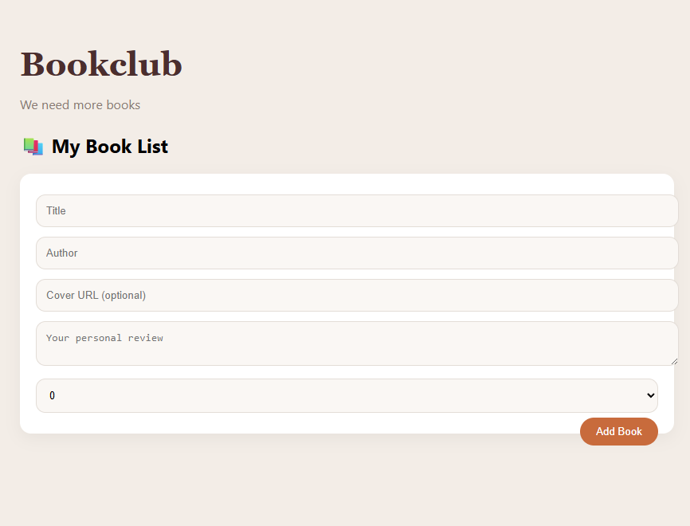

# Weiterentwicklung

## Ziel

Die bestehende Anwendung wurde schrittweise erweitert und verbessert, um sie näher an eine reale Buchclub-App heranzuführen.

---

## Version 5 – Design und Struktur

### Design-Anpassung

Das Design der Anwendung wurde überarbeitet, um eine modernere und benutzerfreundliche Oberfläche zu erreichen.  
Dabei wurde sich an einem zuvor erstellten UI-Design orientiert (warme Farben, klare Struktur, Kartenlayout).

### CSS-Refactoring

Das Styling wurde aus der HTML-Datei ausgelagert und in eine separate CSS-Datei (`css/style.css`) verschoben.

Vorteile:
- bessere Struktur  
- leichtere Wartung  
- Trennung von Inhalt und Design  

### HTML-Struktur

Die HTML-Struktur wurde angepasst, damit die neuen CSS-Klassen korrekt angewendet werden können.

Verwendete Klassen:
- `form`  
- `book`  
- `book-title`  
- `book-author`  
- `actions`  

### Fehlerbehebung

Beim Einfügen des Stylesheets traten Probleme durch ungültige Zeichen auf (z. B. vor Farbwerten).  
Diese wurden entfernt, sodass das Design korrekt dargestellt wird.

### Screenshot

---

## Version 6 – Upload von Buchcovern

Die Anwendung wurde um eine Funktion erweitert, mit der Buchcover direkt vom lokalen Rechner hochgeladen werden können.

Zuvor war nur die Eingabe einer Bild-URL möglich.  
Durch die neue Funktion wird die Nutzung deutlich einfacher und intuitiver.

Technisch wird das ausgewählte Bild im Browser verarbeitet und gespeichert, sodass es direkt angezeigt werden kann.

### Nutzen

- einfachere Bedienung  
- keine externen Bildquellen notwendig  
- bessere Benutzererfahrung  

### Screenshot

### Einschränkung

Die Daten werden im `localStorage` gespeichert und sind nur lokal im Browser verfügbar.  
Eine Synchronisation zwischen verschiedenen Nutzern ist nicht möglich.

---

## Version 7 – Benutzer-Authentifizierung

Die Anwendung wurde zu einer Multi-User-Plattform erweitert.

Benutzer können sich registrieren, einloggen und abmelden.  
Die Authentifizierung erfolgt über E-Mail und Passwort.

### Screenshot

---

## Version 8 – Dashboard und Rollen

Nach erfolgreicher Implementierung der Authentifizierung wurde ein Dashboard eingeführt.

- Administratoren können Bücher hinzufügen  
- Nutzer können auf die gemeinsame Bibliothek zugreifen  

### Screenshot

---

## Version 9 – Bewertungs- und Lesestatistik

Die Anwendung wurde erweitert, sodass Bewertungen nicht nur einzeln gespeichert, sondern auch aggregiert dargestellt werden.

Für jedes Buch werden angezeigt:
- durchschnittliche Bewertung  
- Anzahl der Bewertungen  
- Anzahl der Nutzer, die das Buch als gelesen markiert haben  

Dadurch entsteht ein realistisches Bild der Buchbewertung innerhalb des Buchclubs.

### Screenshot

---

## Version 10 – Echtzeit-Aktualisierung

Es wurde festgestellt, dass Änderungen (Bewertungen, Lesestatus) nicht sofort sichtbar waren.

Die Anwendung wurde daher angepasst, sodass nach jeder Benutzeraktion die Daten neu geladen und direkt angezeigt werden.

Dadurch ist keine Aktualisierung der Seite oder erneutes Einloggen mehr erforderlich.

---

## Aktueller Stand

Die Anwendung verfügt nun über:

- modernes UI  
- Upload von Buchcovern  
- zentrale Datenbank (Multi-User)  
- Benutzer-Authentifizierung  
- Rollen (Admin / Nutzer)  
- gemeinsame Bibliothek  
- Bewertungen und Rezensionen pro Nutzer  
- aggregierte Statistiken  
- Echtzeit-Aktualisierung  

### Screenshot

---

## Nächste Schritte (optional)

- Detailseite für Bücher  
- Kommentare zu Rezensionen  
- Favoritenliste  
- Monatsbuch-Funktion für den Buchclub  
